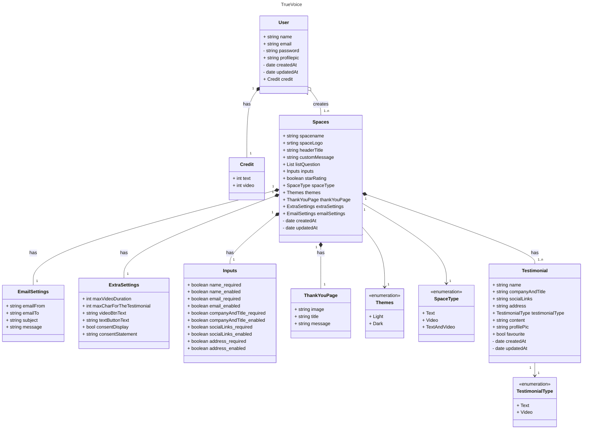

# TrueVoice Project

## Contributors

This project was created and developed by a team of four contributors:

- **Shreya Wanisha** - <wanisha.s@northeastern.edu>
- **Maithili Rajendra Wade** - <wade.mai@northeastern.edu>
- **Jay Vekariya** - <vekariya.ja@northeastern.edu>
- **Harshit Kant** - <kant.h@northeastern.edu>

## PROJECT DESCRIPTION

**TrueVoice** is a user-friendly platform that revolutionizes how businesses collect and showcase customer testimonials. This intuitive solution streamlines the process of gathering authentic video and text testimonials, allowing companies to effortlessly capture the genuine voices of their satisfied customers. With its easy-to-use interface, customizable collection forms, and seamless website integration, TrueVoice empowers businesses to leverage powerful social proof, build trust, and boost conversions.

## Table of Contents

- [TrueVoice Project](#truevoice-project)
  - [PROJECT DESCRIPTION](#project-description)
  - [Table of Contents](#table-of-contents)
  - [Features](#features)
  - [User Stories](#user-stories)
    - [Testimonial Collection](#testimonial-collection)
    - [Testimonial Management](#testimonial-management)
    - [Website Integration](#website-integration)
    - [Analytics and Reporting](#analytics-and-reporting)
    - [Customization](#customization)
    - [User Authentication](#user-authentication)
    - [Object Model Diagram](#object-model-diagram)
    - [Explanation of Relationships and Attributes](#explanation-of-relationships-and-attributes)
    - [API EndPoints](#explaination-of-API's-connected)
    - [Stripe Payment Integration](#Third-Party-Payment)
    - [PWA Functionality](#Progressive-Web-App)
## Features

- **Customizable Collection Forms** - Gather specific information with tailored forms.
- **Video and Text Testimonials** - Collect both video and text testimonials for authenticity.
- **Centralized Dashboard** - Manage testimonials from a single interface.
- **Approval and Categorization** - Control and organize testimonials efficiently.
- **Search and Filter** - Find specific testimonials easily.
- **Website Embedding** - Embed testimonials seamlessly on your website.
- **Responsive Design** - Works on both desktop and mobile devices.
- **Analytics** - Track testimonial performance.
- **Brand Customization** - Brand collection forms to align with the company image.
- **User Authentication** - Secure login, password reset, and profile management.

## User Stories

### Testimonial Collection

1. **Customizable Collection Form** - As a user, I want to create a customizable collection form to gather specific information from my customers.
2. **Video Testimonials** - As a user, I want to record video testimonials from my customers to showcase authentic feedback on my website.
3. **Text Testimonials** - As a user, I want to collect text testimonials from my customers to display written feedback alongside video testimonials.
4. **Responsive Collection Form** - As a user, I want my testimonial collection form to work on desktop and mobile devices.
5. **Multiple Collection Forms** - As a user, I want to create multiple collection forms for different products or services.
6. **Credit Purchase** - As a user, I want to purchase credits to collect more testimonials.

### Testimonial Management

1. **Dashboard** - As a user, I want a centralized dashboard to view all my testimonials.
2. **Approval System** - As a user, I want to approve or reject testimonials to control public display.
3. **Categorization and Tagging** - As a user, I want to categorize and tag testimonials.
4. **Search and Filter** - As a user, I want to search and filter through testimonials.
5. **Select Testimonials for Embedding** - As a user, I want to select specific testimonials for embedding.

### Website Integration

1. **Testimonial Embedding** - As a user, I want to embed testimonial widgets on my website.
2. **Display Customization** - As a user, I want to customize the testimonial display to match my brand.
3. **Responsive Embedding** - As a user, I want the embedded testimonials to display correctly on all devices.

### Analytics and Reporting

1. **Performance Metrics** - As a user, I want to view performance metrics for my testimonials.

### Customization

1. **Branding Forms** - As a user, I want to brand my collection forms to align with my image.
2. **Custom Thank You Messages** - As a user, I want to send customized thank you messages to customers who submit testimonials.
3. **Choose Testimonial Type** - As a user, I want to choose between video or text testimonials.

### User Authentication

1. **Account Creation and Login** - As a user, I want to create an account and log in securely.
2. **Update Profile** - As a user, I want to update my account information.

### Object Model Diagram



### Explanation of Relationships and Attributes

This section provides an overview of the relationships and attributes of each entity in the object model.

- **User**:
  - Attributes:
    - `name`: Name of the user.
    - `email`: Email address of the user.
    - `password`: Hashed password for secure login.
    - `profilePic`: URL or path to the user's profile picture.
    - `createdAt`: Date and time when the user account was created.
    - `updatedAt`: Date and time of the last update to the user’s account.
    - `credit`: Relationship to the `Credit` entity, indicating the user's available credits.

- **Credit**:
  - Attributes:
    - `text`: Amount of text credit available for the user.
    - `video`: Amount of video credit available for the user.
  - Relationship:
    - Linked to the `User` entity, representing the available credits for text and video submissions.

- **Spaces**:
  - Attributes:
    - `spacename`: Name of the space created by the user.
    - `spaceLogo`: Logo associated with the space.
    - `headerTitle`: Title for the space header.
    - `customMessage`: A custom message displayed within the space.
    - `listQuestion`: List of questions or prompts within the space.
    - `inputs`: Relationship to the `Inputs` entity, defining the input fields required in the space.
    - `starRating`: Integer rating displayed in the space.
    - `spaceType`: Type of space (text, video, or both), using `SpaceType` enumeration.
    - `theme`: Relationship to the `Themes` entity, defining the visual theme of the space.
    - `thankYouPage`: Relationship to `ThankYouPage` for displaying a thank-you message after submission.
    - `extraSettings`: Relationship to `ExtraSettings`, providing additional customization options.
    - `emailSettings`: Relationship to `EmailSettings` for configuring email notifications.
    - `createdAt`: Date and time when the space was created.
    - `updatedAt`: Date and time of the last update to the space.

- **EmailSettings**:
  - Attributes:
    - `emailFrom`: Sender's email address.
    - `emailTo`: Recipient's email address.
    - `subject`: Subject line for the email.
    - `message`: Email message content.
  - Relationship:
    - Linked to the `Spaces` entity, defining email configuration for the testimonial collection.

- **ExtraSettings**:
  - Attributes:
    - `maxVideoDuration`: Maximum allowed video duration for testimonials.
    - `maxCharForTheTestimonial`: Maximum character limit for text testimonials.
    - `videoBtnText`: Button text for video submission.
    - `textButtonText`: Button text for text submission.
    - `consentDisplay`: Boolean indicating if a consent form is displayed.
    - `consentStatement`: Text for the consent statement.
  - Relationship:
    - Linked to `Spaces`, providing additional customization for testimonial collection settings.

- **Inputs**:
  - Attributes:
    - `name`, `email`, `companyAndTitle`, `socialLinks`, `address`: Fields required for collecting testimonials.
  - Relationship:
    - Linked to `Spaces`, defining the structure of the testimonial form.
    - Contains multiple `Field` entities indicating if fields are required or enabled.

- **Field**:
  - Attributes:
    - `required`: Boolean indicating if the field is mandatory.
    - `enabled`: Boolean indicating if the field is active in the form.
  - Relationship:
    - Part of the `Inputs` entity, allowing customization of each field in the form.

- **ThankYouPage**:
  - Attributes:
    - `image`: Image to display on the thank-you page.
    - `title`: Title for the thank-you message.
    - `message`: Custom thank-you message content.
  - Relationship:
    - Linked to `Spaces`, providing a customizable thank-you message after testimonial submission.

- **Testimonial**:
  - Attributes:
    - `name`: Name of the testimonial provider.
    - `companyAndTitle`: Company name and title of the testimonial provider.
    - `socialLinks`: Social media or other relevant links.
    - `address`: Address information for the testimonial provider.
    - `testimonialType`: Type of testimonial (text or video) using the `TestimonialType` enumeration.
    - `content`: Content of the testimonial.
    - `profilePic`: URL or path to the testimonial provider’s profile picture.
    - `createdAt`: Date and time when the testimonial was created.
    - `updatedAt`: Date and time of the last update to the testimonial.
  - Relationship:
    - Linked to `Spaces`, representing the testimonials collected within a space.

- **EmbeddedWall**:
  - Attributes:
    - `frameStyle`: Style of the frame for the embedded testimonial wall.
    - `displayTestimonials`: List of `Testimonial` entities to be displayed.
  - Relationship:
    - Linked to `Spaces`, representing a display wall for showcasing testimonials.

- **Themes**:
  - Enumeration defining possible themes for a space.
  - Values:
    - `Light`
    - `Dark`
  - Relationship:
    - Linked to `Spaces`, allowing users to choose between a light or dark theme for their spaces.


- **Enumerations**:
  - **SpaceType**: Defines possible space types.
    - Values: `Text`, `Video`, `TextAndVideo`
  - **TestimonialType**: Defines testimonial types.
    - Values: `Text`, `Video`

### Stripe Payment Integration
1. **Configuration** - Configured Stripe in Test Mode to enable secure payment handling for the app.
2. **Backend Services** -  Created backend services to handle payment intents and integrated them with the frontend.
3. **Error Handling** - Implemented error handling to display relevant messages for failed payments (e.g., insufficient funds, card declined).
4. **Receipt Generation** - Generated receipts for successful payments and displayed detailed error messages for failures.
5. **Test Card Support** :
     **Successful Examples**
    - `Visa: 4242 4242 4242 4242`
    - `Mastercard: 5555 5555 5555 4444`
    - `American Express: 3782 822463 10005`

    **Failure Examples**
   - `Generic Decline: 4000 0000 0000 0002`
   - `Insufficient Funds: 4000 0000 0000 9995`

### PWA(Progressive Web App Functionality)
1. **Configuration** -  Configured the application as a Progressive Web App (PWA) using the Vite PWA plugin.
2. **App Enabling** - Enabled the app to be installed as a standalone application on devices.
3. **Cache Implementation** - Implemented caching for static assets like the logo and other resources for faster load times.
4. **API Calls** - Cached GET API calls to ensure offline access to certain dynamic content.
5. **Internalization** :
     - Integrated internationalization using the i18next library to support multiple languages.
     - Added translation support for English, Hindi, and French.

**Applied translations to key pages such as the landing page,sign up, register page, pricing, profile, payment, payment success, and payment failure pages.**

## How to Run the Application

Follow these steps to set up and run the **TrueVoices** application:

### 1. Clone the Repository
Clone the application repository to your local machine:
```bash
git clone https://github.com/info-6150-fall-2024/final-project-digitalvoices.git
```
2. Install Dependencies
Navigate to both the api and app folders and run the following command to install all necessary dependencies:
```bash
npm install
```
3. Run the Backend

To start the backend server:
	1.	Navigate to the api folder:
    ```
    cd api
      ```
	2.	Run the following command:
       ```
        npm run start
       ```
4. Run the Frontend

To start the frontend development server:
	1.	Navigate to the app folder:
     ```
    cd app
      ```
	2.	Run the following command:
       ```
        npm run dev
       ```
  5. Access the Application

Once the frontend is running, navigate to the following URL in your browser:
```url
http://localhost:3000
```
Now, you are ready to use TrueVoices :)

### NOTE
If you face an issue where the Stripe package is not found while running the application, please manually install the Stripe React package (as sometimes it doesn't get installed by `npm install`) by running the following command:

```bash
npm install @stripe/react-stripe-js @stripe/stripe-js
```

### presentation link :
https://northeastern-my.sharepoint.com/:p:/r/personal/wade_mai_northeastern_edu/Documents/TrueVoices%20INFO6150.pptx?d=w02dbef208c764cdc85f7ba8ea1db9b91&csf=1&web=1&e=JpZ8OU

### Video presentation :
https://northeastern-my.sharepoint.com/:v:/r/personal/vekariya_ja_northeastern_edu/Documents/Microsoft%20Teams%20Chat%20Files/final_video_truevoice.mp4.mov?csf=1&web=1&e=BjSnC7&nav=eyJyZWZlcnJhbEluZm8iOnsicmVmZXJyYWxBcHAiOiJTdHJlYW1XZWJBcHAiLCJyZWZlcnJhbFZpZXciOiJTaGFyZURpYWxvZy1MaW5rIiwicmVmZXJyYWxBcHBQbGF0Zm9ybSI6IldlYiIsInJlZmVycmFsTW9kZSI6InZpZXcifX0%3D


If you have any questions or encounter other issues, please feel free to contact any one of us.

[](https://classroom.github.com/a/DIHvCS29)
