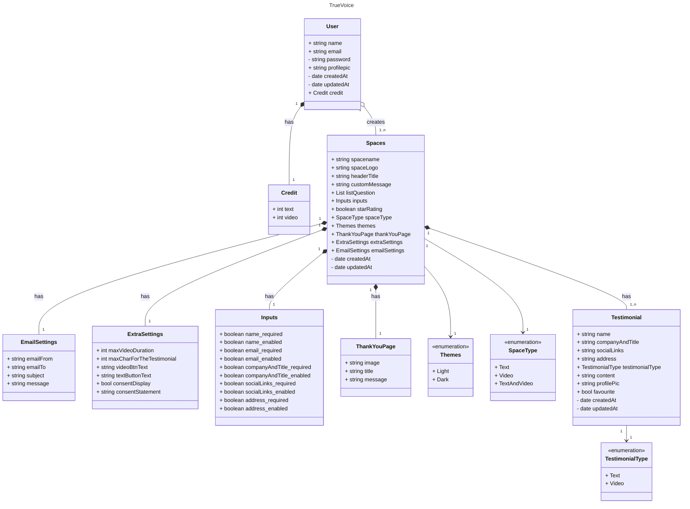

# Object Model Diagram TrueVoices

```mermaid
---
title: TrueVoice
---
classDiagram

  class Credit {
    + int text
    + int video
  }

  class User {
    + string name
    + string email
    - string password
    + string profilepic
    - date createdAt
    - date updatedAt
    + Credit credit
  }

  class Spaces {
    + string spacename
    + srting spaceLogo
    + string headerTitle
    + string customMessage
    + List<string> listQuestion
    + Inputs inputs
    + boolean starRating
    + SpaceType spaceType
    + Themes themes
    + ThankYouPage thankYouPage
    + ExtraSettings extraSettings
    + EmailSettings emailSettings
    - date createdAt
    - date updatedAt
  }

  class EmailSettings {
    + string emailFrom
    + string emailTo
    + string subject
    + string message
  }

  class ExtraSettings {
    + int maxVideoDuration
    + int maxCharForTheTestimonial
    + string videoBtnText
    + string textButtonText
    + bool consentDisplay
    + string consentStatement
  }

  class Inputs {
    + boolean name_required
    + boolean name_enabled
    + boolean email_required
    + boolean email_enabled
    + boolean companyAndTitle_required
    + boolean companyAndTitle_enabled
    + boolean socialLinks_required
    + boolean socialLinks_enabled
    + boolean address_required
    + boolean address_enabled
  }

  class ThankYouPage {
    + string image
    + string title
    + string message
  }

  class Themes {
    <<enumeration>>
    + Light
    + Dark
  }

  class SpaceType {
    <<enumeration>>
    + Text
    + Video
    + TextAndVideo
  }

  class Testimonial {
    + string name
    + string companyAndTitle
    + string socialLinks
    + string address
    + TestimonialType testimonialType
    + string content
    + string profilePic
    + bool favourite
    - date createdAt
    - date updatedAt
  }

  class TestimonialType {
    <<enumeration>>
    + Text
    + Video
  }

  User "1" o-- "1..n" Spaces : creates
  User "1" *-- "1" Credit : has

  Spaces "1" *-- "1" Inputs : has
  Spaces "1" *-- "1" ThankYouPage : has
  Spaces "1" *-- "1" ExtraSettings : has
  Spaces "1" *-- "1" EmailSettings : has
  Spaces "1" --> "1" SpaceType
  Spaces "1" --> "1" Themes
  Spaces "1" *-- "1..n" Testimonial : has

  Testimonial "1" --> "1" TestimonialType
```